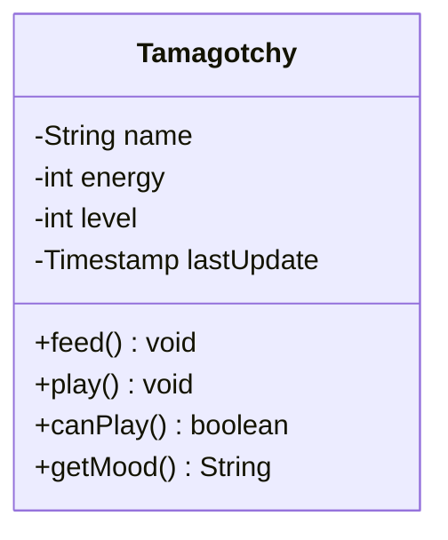
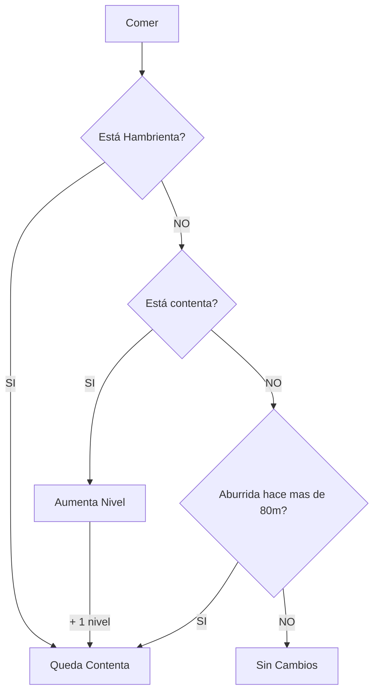
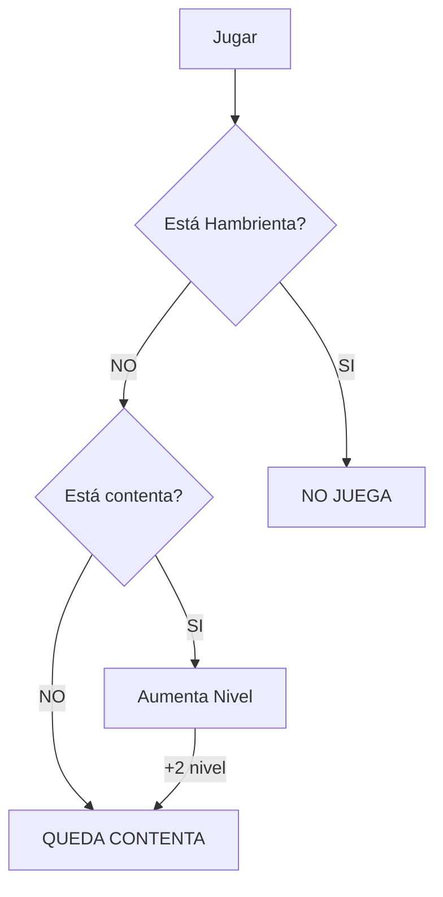

# Proyecto Tamagotchy CAC

## Ejercicio Nivelación: Mascota Virtual
### 1a. 
Modelar una mascota virtual, onda Tamagotchi, incluyendo los mensajes
correspondientes a las acciones de comer y jugar, y la pregunta acerca de si puede
jugar o no.
### 1b. 
También hay que poder conocer el nivel de una mascota, que es un número entero
mayor o igual que 0, donde a mayor nivel, más capa es.
Una mascota puede estar aburrida, hambrienta o contenta; y su comportamiento depende de
en qué estado esté.
Veamos:

## Cuando una mascota come, pasa lo siguiente:
- Si está hambrienta, se pone contenta.
- Si está contenta, su nivel se incrementa en una unidad.
- Si está aburrida, y hace más de 80 minutos que está aburrida, entonces se pone contenta.
- Si está aburrida desde hace 80 minutos o menos, entonces no le pasa nada, no cambia nada.

## Cuando una mascota juega, pasa lo siguiente:
- Si está contenta, su nivel se incrementa en dos unidades.
- Si está aburrida, se pone contenta.
- No produce ningún efecto jugar con la mascota si esta hambrienta.
- Una mascota puede jugar si está contenta o aburrida, si está hambrienta no.

---
NO SE PUEDE CONSULTAR DE NINGUNA MANERA EL ESTADO ACTUAL DE LA
MASCOTA.
Esto quiere decir que está prohibido hacer comparaciones del tipo estado = ‘contento’ o
cualquiera similar utilizando mensajes como estasAburrida.
---

### 2. 
Al finalizar el ejercicio debe haber como mínimo un test unitario por cada posibilidad:
cuando come y cuando juega en cada humor posible. En otras palabras, todo el funcionamiento declarado en el punto 1 debe estar cubierto por pruebas unitarias. Sólo acá está permitido preguntar por su estado actual.

### 3. 
Indique en palabras los pasos necesarios para incorporar un nuevo estado “Triste” en la mascota, de manera que quede listo para funcionar.

# Resolución
## Especificación
Modelar una mascota virtual, onda Tamagotchi, incluyendo los mensajes  
correspondientes a las acciones de comer y jugar, y la pregunta acerca de si puede  
jugar o no.
### Diagrama de clases

### Thresholds
- Los estados (**energía** y **alegría**) se definen con ints de 0 a 100
- El **nivel** esta definido con un int de 0 a "infinito"
- Si tiene menos de 70 la **energía**, tiene hambre.
- Si tiene menos de 60 en **alegría**, esta aburrida.
- Comer da 40 a **energía**.
- Jugar da 30 a **alegría**.
- Los ticks son **por minuto**
- Cada tick cuesta 1 de **energía** y 3 de **alegría**.
- **LastUpdate** indica la última interacción con la mascota.
---

#### Mejoras> Ánimo
- **Ánimo** se define con un int de rango 0 a 100.
- Esto debe de calcularse cuando se solicite **getMood**

---
- **Ánimo** => 50: Feliz
- **Ánimo** < 50: Triste
- Si está aburrida hace mas de 80m **Ánimo** -30
- Si tiene hambre **Ánimo** -20
- Si está aburrida **Ánimo** -10

## Diagrama de flujo
### Comer

---
### JUGAR

